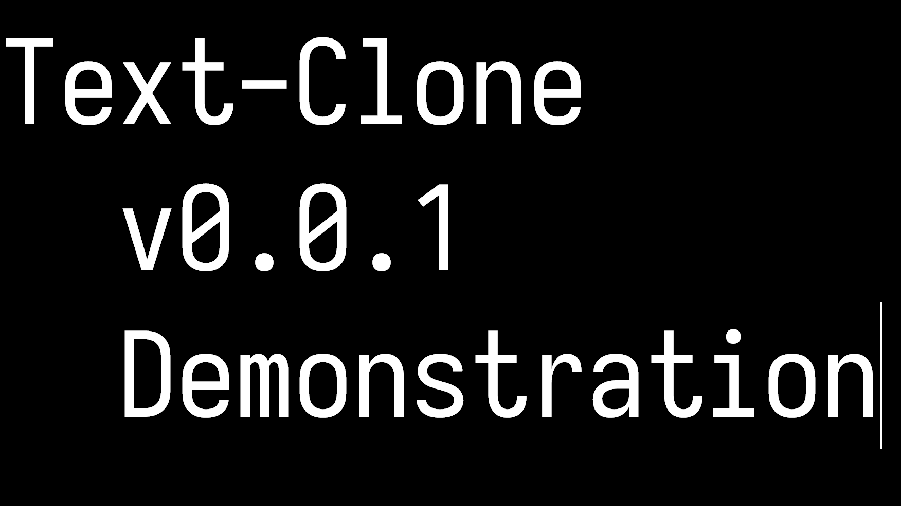

# What is this Document?

[Text-Clone](https://github.com/nobiot/org-transclusion/blob/main/text-clone.el) is a small Emacs package that lets you synchronize regions of text across multiple buffers. It is an "engine" that drives the live-sync feature of Org-transclusion. I call it an engine because it contains no interactive functions for users to manually call. At the moment, Text-Clone is only available as part of Org-transclusion GitHub repository.

I have written this document with Elisp programmers in mind as its main reader. In it, I will try to help you understand how the whole thing works. A bare-bone test Elisp script is also available as a companion to this document so that you can test drive it in your own Emacs. In the source of Text-Clone, I have also tried to detail how each variable and function is meant to work. With all these together, I am hoping that you can craft your own application with using Text-Clone or further extend it.

The script and test files are available at the locations below:
- [text-clone.el](https://github.com/nobiot/org-transclusion/blob/main/text-clone.el)
- [files for test-drive](https://github.com/nobiot/org-transclusion/tree/main/docs/test-clone)

A short video demonstration is also available on [YouTube](https://youtu.be/WNY1BfCqwV4).

# Credits

Text-Clone is an extension of text-clone functions written as part of GNU Emacs in `subr.el` (`text-clone-create` and `text-clone--maintain`; but it is not dependent on them). 

The first adaptation to extend text-clone functions to work across buffers was published in StackExchange by the user named Tobias in March 2020. It can be found at [this thread in StackExchange](https://emacs.stackexchange.com/questions/56201/is-there-an-emacs-package-which-can-mirror-a-region/56202#56202). 

I have made further adaptations for version 0.0.1 in order for it to work with the Org-transclusion package.

# Text-Clone: `text-clone.el` 

It's a small package. It includes two variables and 5 functions, and each of them comes with a docstring explaining what it is meant to do. I have made available a set of an Elisp script and test text files that let you test-drive Text-Clone.

Out of the five functions, you only need to deal with 3, and one of them is a just a convenience wrapper function to document and standardize the parameters to pass to the built-in `make-overlay` function. Effectively, you will need to consciously use `text-clone-set-overlays` and `text-clone-delete-overlays` functions. As a developer, you should be aware of what the two variable and the rest of the functions are meant to do but you don't need to write your own functions to use them for the live-sync feature.

Below is a list of functions and commentaries for each of them:

- Function: `text-clone-make-overlay (beg end &optional buf)`
   A wrapper function. I recommend to use it to create overlays for text-clone but not mandatory. 
   It is meant to document and standardize the parameters passed to the built-in `make-overlay` function.
   
- Function: `text-clone-set-overlays (&rest overlays)`
   Call it explicitly in your function; pass overlays to required properties for live-sync. It also sets `post-command-hook` locally with `text-clone-command-h` function, and the global variable `text-clone-overlays ` to start tracking the overlays.

- Function:  `text-clone-delete-overlays ()`
  Call it explicitly in your function. It deletes the Text-Clone overlays tracked by the variable `text-clone-overlays `.

- Function: `text-clone-post-command-h ()`
  You don't need to call it explicitly. Set and unset by `text-clone-overlays` and `text-clone-delete-overlay` respectively. 

- Function: text-clone-live-sync
  You don't need to call it explicitly. Set by `text-clone-set-overlays` to appropriate
  overlay properties for live-sync.

# How to Test Script and Test Files

The script is a bare minimum simple test script. It comes with three test text files -- two of them are empty. Simply evaluate the whole buffer, and call `test-text-clone` command. It will copy the text from `test-clone-original.txt`, and paste it to the two empty files, `test-clone-1.txt` and `test-clone-2.txt`. The script then adds faces to overlays.  You can test the live-sync feature from any of the three text files by simply typing text within an overlay.

Call `test-text-clone-finish` to end the test drive. It will empty both the clone text files, leaving `txt` as it is. It does not reset itself; you can have any text as you like in it.
